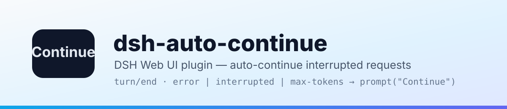
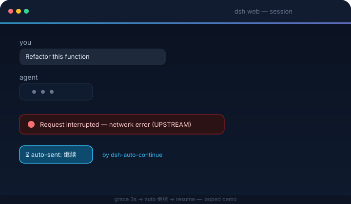

<p align="center">
  <picture>
    <source media="(prefers-color-scheme: dark)" srcset="docs/banner-dark.svg">
    
  </picture>
</p>

<h1 align="center">dsh-auto-continue</h1>

<p align="center">
  <em>DSH Web UI plugin — when a request is interrupted by a network error or any other non-human cause, it automatically sends “Continue” for you.</em>
</p>

<p align="center">
  <a href="https://www.npmjs.com/package/dsh-client-auto-continue"></a>
  <a href="https://www.npmjs.com/package/dsh-client-auto-continue"></a>
  <a href="https://github.com/HsiangNianian/dsh-auto-continue/stargazers"></a>
  <a href="https://github.com/HsiangNianian/dsh-auto-continue/blob/main/LICENSE"></a>
  <a href="https://awesome-dsh-plugin.com"></a>
  <a href="https://www.dsh.so/artifact/dsh-auto-continue/"></a>
  <br>
  
  
  
</p>

<p align="center">
  <b>English</b> · <a href="README.zh.md">中文</a>
</p>

---

## What It Does

For [DeepSeek Harness](https://github.com/deepseek-ai/deepseek-harness) (`dsh web`): whenever a request in the web GUI gets interrupted by a **non-human cause**, the plugin simulates the user typing **“Continue”** and sends it, so the agent keeps working without manual intervention. The message enters the session log exactly like a manual prompt — the model sees it, and the interrupted work resumes. Since 0.8.0 the engine runs **inside the host process** (single instance), so it keeps watching even with every browser tab closed, and multiple open tabs can never double-send.



**Smart recovery** (all configurable):

- **Error classification** — transient failures (network / timeout / 5xx / 429…) are auto-resumed; permanent ones are **skipped** and notified, because retrying them never helps. A failure counts as permanent when its HTTP status is 401/403 or its code/message matches auth, credential/API-key, balance/quota, unknown-model, or context-length/overflow keywords. Provider-specific exceptions can be opted into with literal custom retryable patterns; turn classification off to resume everything
- **Adaptive backoff** — consecutive failures wait longer each time (cooldown × factor: 20s → 40s → 80s…), capped at the max backoff, instead of hammering a broken upstream
- **English / Chinese localization** — the settings card, built-in resume / guard / loop text, and browser notifications follow DSH's active UI language (initially selected from the browser language). Only `en` and `zh` are supported; other languages fall back to Chinese. Switching languages updates built-in defaults without overwriting custom text
- **Templated continue text** — `continueText` supports `{code}` `{message}` `{status}` `{tool}` `{turn}` `{errorCount}` `{sessionTitle}` `{elapsed}` placeholders, so the resume message can carry the failure context ("Continue ({tool} failed: {code})"); a **separate template** fires on `max-tokens` (e.g. "Continue the output without repeating anything already generated")
- **Idempotency guard** — before resuming, the plugin inspects the last tool call: if its result is unconfirmed (the turn died mid-tool, e.g. a `git push` that may have gone through), the resume message tells the model to check state first and not to rerun; if the tool is confirmed done, it says so and asks not to repeat it; a failed tool gets no guard (retrying it is the point). Both guard texts are configurable (`{tool}` / `{result}` placeholders)
- **Pause** — a global **Pause auto-continue** toggle in the settings card stops everything (live + scan) instantly; per-session pauses (e.g. via a notification button) suspend only one session until they expire. The **Resume now** notification button is the one explicit exception: pressing it is the user asking for exactly one send, pause or not
- **Notification buttons** — notifications carry **Resume now** (send immediately, ignoring cooldown, the consecutive cap and any pause) and **Pause this session 1h** actions
- **Loop guard** — watches **running** turns too. Three signals trip the guard, which cancels the turn and restarts it with a configurable loop text ("stop repeating, try another way"): the model repeating the **exact same message** several times (any length — e.g. "Let me test variants of the regex…" ×7), many short messages inside a short time window with no tool call in between (the "Let me read…" spin), or the same tool called repeatedly with the **same arguments and the same results** (a changed argument or result counts as progress). The cancel carries an internal marker so it is never confused with a user stop — the restart only happens for guard-initiated cancels. Thresholds, the time window and the loop text are configurable
- **Stats panel** — the settings card shows today's auto-continue count, recoveries, failures, permanent skips, give-ups and loop breaks, broken down by error code, with a one-click reset
- **Browser notifications** — optional alerts when auto-continue fires, gives up, or hits a permanent error; the browser asks for permission on first use, and nothing is shown again after a denial

It watches the live event streams and reacts to:

| Event | Meaning |
| --- | --- |
| `turn/end` → `error` | Turn failed (model / network / timeout, …) |
| `turn/end` → `interrupted` | Crash-orphaned turn left behind by a host restart (recovered by the startup scan) |
| `turn/end` → `max-tokens` | Output token ceiling reached |
| `host/agent-error` | Agent failure with no turn position (only network/timeout-class messages auto-resume) |

**Never auto-continues:** user-aborted turns (`aborted`) or policy rejections (`blocked`); live `interrupted` turn-ends too — that marker is only written by crash repair when the host reloads, so orphaned turns are recovered by the startup scan, not the live path; sessions the host already resumed itself; running sessions or sessions with queued messages; subagent sessions; anything inside the cooldown / consecutive-cap windows (configurable in the settings card, below).

---

## How It Works

The host-side engine subscribes to the session event firehose inside the dsh host process — exactly one engine, regardless of how many tabs are open (the duplicate-send class of bugs cannot exist by construction). On an interruption it waits a **grace period** (default 3 s) — if the host starts a new turn by itself (`turn/start`), the auto-continue is cancelled — then sends the configured text through the agent registry (`agent.followup`, the same queue the Send button uses).

On host boot it also scans the live sessions: a session whose last turn ended with a non-human reason **within the scan window** (default 15 minutes), with no later `turn/start` or user message, gets resumed automatically too (e.g. the host crashed while the browser was closed — the agent-loop resumes the session and the engine picks it up).

The browser half is a thin shell: the settings card, plus a status bridge that shows notifications (with Resume now / Pause this session 1h buttons, routed back to the host engine) and feeds the card's stats / paused-sessions panels.

### Recovery workflow

The diagram summarizes the automatic recovery path, the loop-guard restart path, and the exit to human intervention. Click it to open the full-size version.

[](docs/auto-continue-workflow.en.svg)

## Quick Start

DSH plugins install into a **profile** (`dsh web` → `web` profile). Install, restart `dsh web`, done.

> **Use the latest DSH (recommended: 0.1.2-alpha.4 or newer).** Run `dsh --version` before installing. Plugin v0.11.1 supports the settings API used by DSH 0.1.2-alpha.2+ (including alpha.3 and alpha.4) while retaining compatibility with DSH 0.1.0-rc.7 through 0.1.1; rc.6 and earlier remain unsupported (`list slot ... requires options.id`). Preview releases may appear on the [official DSH releases page](https://github.com/deepseek-ai/deepseek-harness/releases) before the public npm tag catches up.

### From npm (recommended)

Published as [`dsh-client-auto-continue`](https://www.npmjs.com/package/dsh-client-auto-continue):

```bash
dsh plugin --profile web add dsh-client-auto-continue
dsh web
```

### Directly from GitHub (no clone needed)

Installs straight from the repository's default branch — built artifacts are committed, so no local clone or build step:

```bash
dsh plugin --profile web add github:HsiangNianian/dsh-auto-continue
dsh web
```

> This tracks the `main` branch rather than released tags — great for trying the latest changes, while the npm method above is the stable choice. Switching between install sources is just re-running `dsh plugin --profile web add <other-spec>`; the profile dependency is replaced in place.

### From this repository

Requires Node.js ≥ 18.

```bash
git clone https://github.com/HsiangNianian/dsh-auto-continue.git
cd dsh-auto-continue
npm install
npm run build

# the package carries its own cordis.patch.yml (dsh.bundle.patch),
# so the plugin row registers itself
dsh plugin --profile web add link:$(pwd)

dsh web
```

### Manual (no pnpm / dsh plugin needed)

```bash
ln -sfn "$(pwd)" ~/.dsh/profiles/node_modules/dsh-client-auto-continue
# then append to ~/.dsh/profiles/web/cordis.patch.yml:
#   - insert:
#       - id: auto-continue
#         name: 'dsh-client-auto-continue'
dsh web
```

> Switching from a manual install to `dsh plugin add`? Remove the manual `insert` entry first — the bundle patch registers the row and a duplicate would conflict.

> **Settings exposure:** since DSH 0.1.0-rc.7 the web settings surface is **registry-driven** — every namespace a plugin registers is served, so the settings card works out of the box, no vendor patch needed (the plugin requires rc.7+, see Quick Start).

### Verify & uninstall

```bash
dsh --profile web --dump-config | grep auto-continue   # config layer mounted
```

In the browser console (Ctrl/Cmd+Shift+I): `[auto-continue] 已启动(文本="继续", …)` — every detection and auto-send is logged.

```bash
dsh plugin --profile web remove dsh-client-auto-continue   # npm / repo install
# or remove the symlink + the insert entry                  # manual install
dsh web
```

---

## Configuration

Everything is configurable from the GUI — no file or console edits needed. Open **Settings → Plugins → Plugin configuration**. **Auto Continue** appears as a collapsed card alongside the other plugins; click the card or its right-hand chevron to expand the full configuration in place. Besides the fields below, the expanded card shows a live **stats panel** (today's activity with a reset button) and the list of **paused sessions** (each with a per-session resume button).

The settings card groups controls by handoff, safety, recovery, loop breaking, and live status. Its header also keeps the open-source repository and a **Star on GitHub** shortcut within reach.

**Or skip the GUI and edit the config file directly** — the engine reads the plugin's section from `~/.dsh/settings.yaml` (one shared file for every plugin's sections), so this works in any install, patched or not. The file is watched and re-read automatically, so changes apply live; restart `dsh web` if a page that was already open doesn't pick them up. Fields you leave out fall back to the defaults in the table below.

The browser mirrors DSH's active language into the internal `locale` field. Leave the five localized text fields empty or omit them to follow that language automatically; any non-empty value is treated as your own template and is never rewritten when the language changes:

```yaml
auto-continue:
  locale: 'en' # normally managed by the browser
  paused: false
  continueText: ''
  continueTextMaxTokens: ''
  guardTools: true
  guardPendingText: ''
  guardDoneText: ''
  graceMs: 3000
  cooldownMs: 20000
  maxConsecutive: 3
  scanOnBoot: true
  scanLimit: 8
  freshMs: 900000
  verbose: true
  classify: true
  retryableErrorPatterns: ''
  backoffFactor: 2
  backoffMaxMs: 300000
  notify: false
  loopGuard: true
  loopShortChars: 40
  loopWindowMs: 30000
  loopShortCount: 12
  loopRepeatText: 4
  loopToolRepeat: 5
  loopText: ''
```

**How the card works:**


- Edits are **staged** — nothing reaches the disk until you hit **Save**; an unsaved badge marks the card while drafts are pending, and **Discard** drops them
- A field you changed shows an **Overridden** badge with a per-field **Reset to default** button that restores the built-in value
- Boolean fields are **tri-state**: *Inherit* (use the default) / *On* / *Off*
- Invalid drafts (non-numbers, values below the minimum) block the save with a hint
- In a read-only deployment the card shows the stored values but disables every control
- Changes apply immediately after Save and persist in `~/.dsh/settings.yaml` (uninstalling the plugin leaves the section behind — harmless, delete it by hand if you like)

| Field | Default | Description |
| --- | --- | --- |
| Pause auto-continue | `off` | Global pause: no live or scan auto-send fires, queued pending sends are cancelled |
| Continue text | `Continue` | Text automatically sent after an interruption |
| Continue text (max tokens) | `Continue` | Text sent when the output token ceiling is reached (same placeholders) |
| Idempotency guard | `on` | Inspect the last tool call before resuming and steer the model (see What It Does) |
| Loop guard | `on` | Detect a running turn spinning in place and restart it (see What It Does) |
| Short-sentence max (chars) | `40` | A model message shorter than this counts as a short sentence (spinning signal) |
| Short-sentence window (ms) | `30000` | Consecutive short sentences must land inside this window; normal thinking spread over time is not misjudged |
| Short-sentence threshold | `12` | Consecutive short sentences inside the window, with no tool call in between, trip the loop guard |
| Identical message count | `4` | Consecutive identical messages (any length) trip the loop guard — the strongest spinning signal |
| Same-tool repeat count | `5` | Consecutive calls of the same tool with identical arguments and results trip the loop guard |
| Loop text | `(You may be stuck in a loop. Stop repeating the last action and continue with a different approach.)` | Text sent after the loop guard restarts a turn; `{tool}` placeholder |
| Guard text (unconfirmed result) | `(The previous tool "{tool}" may not have completed. Check its state before continuing and do not run it again.)` | Appended when the last tool may have partially executed; `{tool}` placeholder |
| Guard text (tool succeeded) | `(The previous tool "{tool}" completed successfully. Result: {result}; do not run it again. Continue from there.)` | Appended when the last tool is confirmed done; `{tool}` / `{result}` placeholders |
| Grace period (ms) | `3000` | Wait after an interruption; cancelled if the host recovers on its own |
| Cooldown (ms) | `20000` | Min interval between auto-continues per session (failed attempts count too) |
| Max consecutive | `3` | Max consecutive auto-continues; stops until a user intervenes or a turn completes |
| Scan on load / reconnect | `on` | Scan recently interrupted sessions on load / reconnect |
| Scan limit | `8` | Max sessions scanned (running / subagent sessions excluded) |
| Scan window (ms) | `900000` | Scan only considers interruptions inside this window |
| Verbose logs | `on` | `[auto-continue]` console logs |
| Classify errors | `on` | Auto-resume transient failures only; auth / balance / model errors are skipped and notified |
| Custom retryable errors | empty | One case-insensitive literal per line; matching the error code, HTTP status, or message explicitly overrides the built-in classifier |
| Backoff factor | `2` | Cooldown multiplier per consecutive failure (2 = 20s → 40s → 80s…) |
| Max backoff (ms) | `300000` | Cap on the adaptive backoff interval |
| Browser notifications | `off` | Notify when auto-continue fires, gives up, or hits a permanent error |

For a provider-specific error that is safe to resume (confirm first that manually sending "continue" recovers), add a narrow, stable fragment rather than disabling classification globally:

```yaml
auto-continue:
  retryableErrorPatterns: |-
    Upstream rejected the request as invalid
```

Patterns are literal substrings, not regular expressions. Blank lines are ignored; any matching line wins before the built-in permanent-error rules. Cooldown and consecutive-attempt limits still apply.

`continueText` (and `continueTextMaxTokens`) accept the placeholders `{code}`, `{message}`, `{status}`, `{tool}` (last tool call before the failure), `{turn}`, `{errorCount}` (consecutive failures including this one), `{sessionTitle}` (from the session list) and `{elapsed}` (time since the failure, e.g. `1m5s`) — e.g. `Continue ({tool}: {code})` becomes `Continue (git push: UPSTREAM)`. The guard texts accept `{tool}` and `{result}` (a truncated excerpt of the last tool output).

---

## Privacy & permissions

The plugin is browser-only and touches **no files, credentials, or network beyond the dsh host**:

- It opens the same two read-only event streams the web UI already uses (no extra server, no third-party endpoints)
- The engine's **only automatic write** is `sessions.prompt` — the same call the Send button makes — with the text you configured (saving the settings card writes the `auto-continue` section of `~/.dsh/settings.yaml` through the normal settings API, exactly like any other setting)
- No browser storage at all: the single host-side engine keeps its cooldowns, send caps, pauses and stats in process memory
- Browser notifications are opt-in (`notify` setting) and permission is requested on first use only

---

## Development

```bash
npm run typecheck   # tsc --noEmit
npm run build       # lib/client.js + lib/index.js + lib/types
npm run watch       # rebuild on change; host HMR hot-reloads without a page refresh
npm run test        # node tests/simulate-host.mjs — 15 host-side behavioral scenarios
```

While `npm run watch` runs, the profile's client-hmr row polls `lib/client.js` every 500 ms and hot-reloads the plugin in the browser — no server restart needed for code changes.

CI installs from the lockfile, typechecks, rebuilds and verifies committed artifacts, runs the host and dual-layout client simulations, then runs [dsh-plugin-check](https://github.com/omdsh-dev/dsh-plugin-check). The same health check gates releases.

---

## Activity

[](https://gitstock.org/HsiangNianian/dsh-auto-continue)

---

## Links

- **Repository**: [github.com/HsiangNianian/dsh-auto-continue](https://github.com/HsiangNianian/dsh-auto-continue)
- **LINUX DO**: [linux.do](https://linux.do)
- **DeepSeek Harness**: [github.com/deepseek-ai/deepseek-harness](https://github.com/deepseek-ai/deepseek-harness)
- **dsh-plugin-check**: [github.com/omdsh-dev/dsh-plugin-check](https://github.com/omdsh-dev/dsh-plugin-check) — health-check your own DSH plugin repos

---

## License

[](LICENSE)

MIT © Hsiang Nianian
