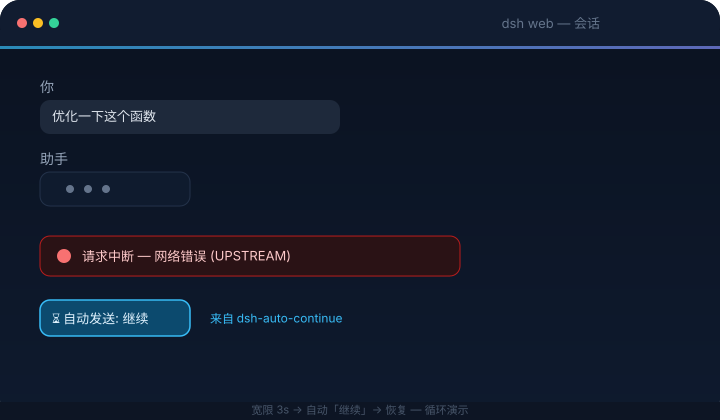
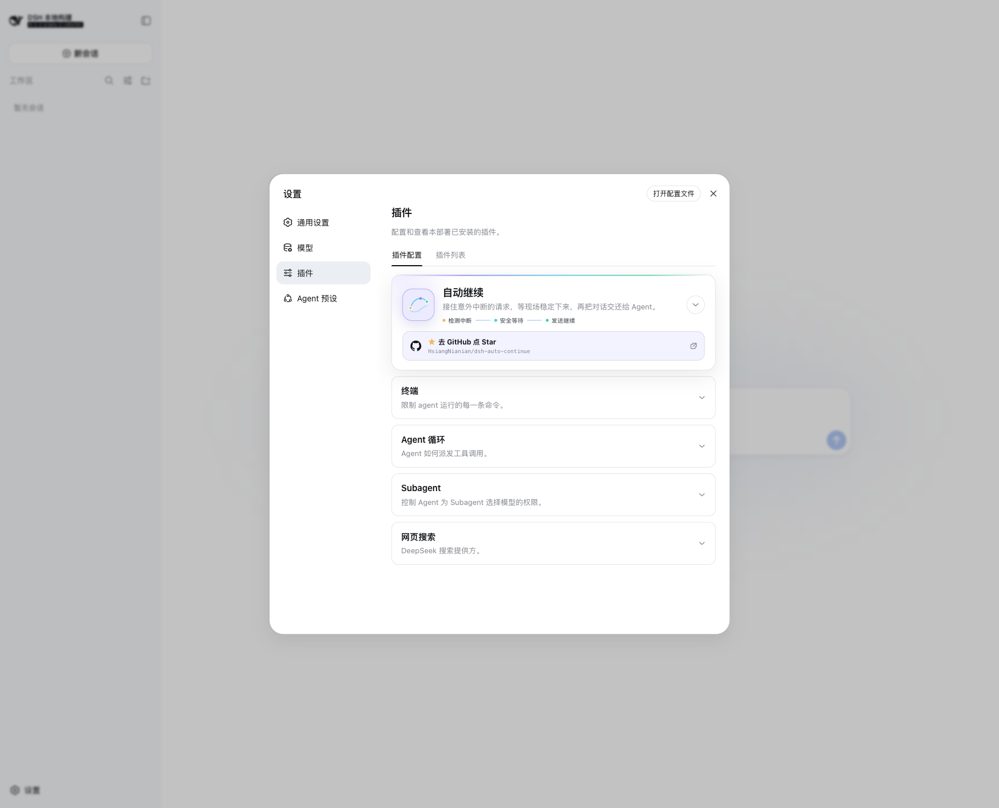

<p align="center">
  <picture>
    <source media="(prefers-color-scheme: dark)" srcset="docs/banner-zh-dark.svg">
    
  </picture>
</p>

<h1 align="center">dsh-auto-continue</h1>

<p align="center">
  <em>DSH Web UI 插件 —— 当请求因为网络错误等非人为因素中断时, 自动替你输入「继续」并发送。</em>
</p>

<p align="center">
  <a href="https://www.npmjs.com/package/dsh-client-auto-continue"></a>
  <a href="https://www.npmjs.com/package/dsh-client-auto-continue"></a>
  <a href="https://github.com/HsiangNianian/dsh-auto-continue/stargazers"></a>
  <a href="https://github.com/HsiangNianian/dsh-auto-continue/blob/main/LICENSE"></a>
  <a href="https://awesome-dsh-plugin.com"></a>
  <a href="https://www.dsh.so/artifact/dsh-auto-continue/"></a>
  <br>
  
  
  
</p>

<p align="center">
  <a href="README.md">English</a> · <b>中文</b>
</p>

---

## 它做什么

适用于 [DeepSeek Harness](https://github.com/deepseek-ai/deepseek-harness)(`dsh web`): 当 webui 里的请求因为**非人为因素**中断时, 插件模拟用户输入 **「继续」** 并自动发送, 让 Agent 继续干活, 无需手动干预。消息与手动输入完全等价——进入会话日志、对模型可见, 中断的任务随即恢复。自 0.8.0 起引擎跑在**宿主进程内**(单实例): 浏览器标签全关掉也在值守, 多标签页同时打开也不可能重复发送。



**智能恢复**(全部可配置):

- **错误分类** — 临时性错误(网络 / 超时 / 5xx / 429 等)自动续跑; 永久性错误跳过并通知, 因为重试也没用。判定为永久性的条件: HTTP 状态码 401/403, 或 code/message 命中认证、凭据/API Key、余额/配额、模型不存在、上下文长度/超限等关键词。provider 专属例外可由用户显式填写普通文本匹配; 关闭分类后则全部自动继续
- **自适应退避** — 连续失败时等待时间递增(冷却 × 系数: 20s → 40s → 80s…), 有上限, 不再对故障上游狂轰滥炸
- **中英文本地化** — 设置卡片、内置续跑 / 护栏 / 循环文案以及浏览器通知都跟随 DSH 当前界面语言(初始值来自浏览器语言)。只支持 `en` 和 `zh`, 其他语言回落中文; 切换语言只会替换内置默认值, 不会覆盖用户自定义文本
- **模板化继续文本** — `continueText` 支持 `{code}` `{message}` `{status}` `{tool}` `{turn}` `{errorCount}` `{sessionTitle}` `{elapsed}` 占位符, 续跑消息可携带失败上下文(如「继续 (git push 失败: UPSTREAM)」); 达到 `max-tokens` 时使用**另一套模板**(如「继续输出, 不要重复已生成的内容」)
- **幂等护栏** — 续跑前检查上一步工具调用: 结果未确认(回合在工具执行中途夭折, 如 `git push` 可能已经推上去了)时, 续跑消息会提示模型先确认状态、不要重复执行; 工具已确认成功时说明已完成、请勿重复; 工具失败则不加护栏(重试本来就是目的)。两段护栏文本都可配置(支持 `{tool}` / `{result}` 占位符)
- **暂停** — 设置卡片里的全局 **暂停自动继续** 开关可立即停掉一切(实时 + 扫描); 会话级暂停(如通过通知按钮)只挂起单个会话, 到期自动恢复。唯一的显式例外是通知里的 **立即续跑** 按钮——按下它等于用户明确要求发送这一次, 不受暂停限制
- **通知按钮** — 通知带 **立即续跑**(无视冷却、连续上限与暂停, 马上发送)和 **暂停该会话 1 小时** 按钮
- **循环守卫** — 连**运行中的回合**也盯着, 三个信号都会触发守卫(取消当前回合并用可配置的循环提示文本重启, 「停止重复, 换一种方式」): 模型**连续输出完全相同的消息**(不限长度, 如 "Let me test variants of the regex…" 连续 7 遍)、短时间内连续多条短句且期间无工具调用(典型的「Let me read…」空转)、或同一工具被连续反复调用且**参数与结果都相同**(参数或结果有变化视为有进展)。取消带有内部来源标记, 绝不会与用户手动停止混淆——只有守卫发起的取消才会重启。阈值、时间窗与提示文本都可配置
- **统计面板** — 设置卡片展示今日自动继续次数、恢复成功、继续后失败、永久性跳过、达上限停止、循环打断, 按错误码统计, 可一键清零
- **浏览器通知** — 可选: 自动继续成功 / 放弃 / 遇到永久性错误时弹出提醒; 首次使用时请求权限, 被拒绝后不再打扰

插件监听实时事件流, 对以下情况作出反应:

| 事件 | 含义 |
| --- | --- |
| `turn/end` → `error` | 回合失败(模型 / 网络 / 超时等) |
| `turn/end` → `interrupted` | 宿主崩溃重启后遗留的中断回合(由启动扫描恢复) |
| `turn/end` → `max-tokens` | 达到输出 token 上限 |
| `host/agent-error` | 无回合位置的 Agent 失败(仅网络/超时类消息自动续跑) |

**绝不自动继续:** 用户主动停止(`aborted`)或策略拒绝(`blocked`); 实时流里的 `interrupted` 同样不自动继续——该标记只在宿主重载时由崩溃修复写入, 孤儿回合由启动扫描恢复, 不走实时路径; 宿主已自行恢复的会话; 正在运行或已有排队消息的会话; 子代理会话; 处于冷却期 / 连续次数上限内的会话(可在设置卡片中调整, 见下)。

---

## 工作原理

宿主侧引擎在 dsh 宿主进程内订阅会话事件 firehose——**全局只有一个引擎**, 无论开多少个标签页(重复发送这类 bug 从构造上不可能存在)。检测到中断后先等待一个**宽限期**(默认 3 秒)——若宿主自行开启了新回合(`turn/start`), 自动继续即取消——然后经 agent 注册表(`agent.followup`, 与「发送」按钮同一个排队通道)发送配置的文本。

宿主启动时还会扫描存活会话: 最后一个回合在**扫描时间窗**(默认 15 分钟)内以非人为原因结束、且其后没有新回合或用户消息的会话, 会被自动续跑(例如浏览器关闭期间宿主崩溃——agent-loop 恢复会话后引擎接着接手)。

浏览器半侧是瘦壳: 设置卡片 + 一条状态桥(展示通知, 带「立即续跑 / 暂停该会话 1 小时」按钮并把动作回传给宿主引擎; 驱动卡片里的统计与暂停面板)。

### 恢复流程

下图汇总了自动恢复主链、循环守卫重启路径和等待人工介入的出口。点击图片可查看原尺寸版本。

[](docs/auto-continue-workflow.svg)

## 快速开始

DSH 插件安装进 **profile**(`dsh web` 对应 `web` profile)。安装后重启 `dsh web` 即可。

> **请使用最新 DSH(推荐 0.1.2-alpha.4 或更高版本)。** 安装前先运行 `dsh --version`。插件 v0.11.1 已支持 DSH 0.1.2-alpha.2+ 使用的设置 API(包括 alpha.3 和 alpha.4), 同时继续兼容 DSH 0.1.0-rc.7 至 0.1.1; rc.6 及更早版本仍不支持(`list slot ... requires options.id`)。预览版可能先发布在 [DSH 官方 Releases](https://github.com/deepseek-ai/deepseek-harness/releases), 公开 npm 标签会稍后跟进。

### 从 npm 安装(推荐)

已发布为 [`dsh-client-auto-continue`](https://www.npmjs.com/package/dsh-client-auto-continue):

```bash
dsh plugin --profile web add dsh-client-auto-continue
dsh web
```

### 直接从 GitHub 安装(无需克隆)

直接从仓库默认分支安装——构建产物已提交入库, 无需本地克隆或构建:

```bash
dsh plugin --profile web add github:HsiangNianian/dsh-auto-continue
dsh web
```

> 该方式跟踪 `main` 分支而不是发布 tag——适合尝鲜最新改动, 稳定性首选上面的 npm 方式。切换安装来源只需重新执行 `dsh plugin --profile web add <其他来源>`, profile 依赖会被就地替换。

### 从本仓库安装

需要 Node.js ≥ 18。

```bash
git clone https://github.com/HsiangNianian/dsh-auto-continue.git
cd dsh-auto-continue
npm install
npm run build

# 包自带 cordis.patch.yml(通过 dsh.bundle.patch 声明),
# 插件行会自动注册
dsh plugin --profile web add link:$(pwd)

dsh web
```

### 手动安装(无需 pnpm / dsh plugin)

```bash
ln -sfn "$(pwd)" ~/.dsh/profiles/node_modules/dsh-client-auto-continue
# 然后在 ~/.dsh/profiles/web/cordis.patch.yml 追加:
#   - insert:
#       - id: auto-continue
#         name: 'dsh-client-auto-continue'
dsh web
```

> 从手动安装切换到 `dsh plugin add` 时, 请先删掉手动加的 `insert` 条目——包自带的 bundle patch 会注册插件行, 重复注册会冲突。

> **设置暴露:** DSH 0.1.0-rc.7 起 webui 设置区是**注册表驱动**的——插件注册的命名空间直接可见, 设置卡片开箱即用, 无需任何供应商补丁(插件要求 rc.7+, 见快速开始)。

### 验证与卸载

```bash
dsh --profile web --dump-config | grep auto-continue   # 确认配置层已挂载
```

浏览器控制台(Ctrl/Cmd+Shift+I)中应看到 `[auto-continue] 已启动(文本="继续", …)`; 每次检测到中断和自动发送都会打日志。

```bash
dsh plugin --profile web remove dsh-client-auto-continue   # npm / 仓库安装
# 或删除软链 + insert 条目                                  # 手动安装
dsh web
```

---

## 配置

所有参数都可以在 GUI 里配置——无需改文件或控制台。打开 **设置 → 插件 → 插件配置**, **自动继续**会像其他插件一样显示为列表中的折叠卡片; 点击卡片或右侧箭头即可在当前位置展开完整配置。除了下面的字段, 展开后的卡片还带一个**统计面板**(今日活动, 可一键清零)和**已暂停会话**列表(每个都可单独解除)。

新版配置卡会按接力方式、安全节奏、恢复雷达、循环断路器与现场状态组织配置; 卡片顶部也直接放出了开源仓库和 **Star on GitHub** 入口。

**或者跳过 GUI, 直接编辑配置文件** — 引擎从 `~/.dsh/settings.yaml` 读取插件段落(所有插件的设置都在这一个文件里), 因此无论是否打过补丁都能用。文件被监听、自动重读, 改动即时生效; 若已打开的页面没反应, 重启 `dsh web` 即可。没填写的字段会回落到下表中的默认值。

浏览器会把 DSH 当前语言同步到内部 `locale` 字段。下面五个本地化文本字段保持留空或直接省略时, 会自动跟随语言; 任何非空值都视为用户自己的模板, 切换语言时不会改写:

```yaml
auto-continue:
  locale: 'zh' # 通常由浏览器自动维护
  paused: false
  continueText: ''
  continueTextMaxTokens: ''
  guardTools: true
  guardPendingText: ''
  guardDoneText: ''
  graceMs: 3000
  cooldownMs: 20000
  maxConsecutive: 3
  scanOnBoot: true
  scanLimit: 8
  freshMs: 900000
  verbose: true
  classify: true
  retryableErrorPatterns: ''
  backoffFactor: 2
  backoffMaxMs: 300000
  notify: false
  loopGuard: true
  loopShortChars: 40
  loopWindowMs: 30000
  loopShortCount: 12
  loopRepeatText: 4
  loopToolRepeat: 5
  loopText: ''
```

**卡片操作说明:**



- 修改是**暂存式**的——点「保存」之前不会写入磁盘; 有待保存草稿时卡片显示「未保存」徽章, 「放弃」可丢弃草稿
- 改动过的字段会带「已覆盖」徽章, 并有逐字段的「恢复默认」按钮(回到内置默认值)
- 布尔字段是三态:**继承**(用默认)/ 开 / 关
- 非法输入(非数字、小于最小值)会阻止保存并给出提示
- 只读部署中卡片只显示已存值, 所有控件禁用
- 保存后立即生效, 持久化在 `~/.dsh/settings.yaml`(卸载插件会留下该段落, 无害, 想清理可手动删除)

| 字段 | 默认 | 说明 |
| --- | --- | --- |
| 暂停自动继续 | 关 | 全局暂停: 实时与扫描都不再自动发送, 已排队的待发送也会取消 |
| 继续文本 | `继续` | 中断后自动发送的消息内容 |
| 超限时的继续文本 | `继续` | 达到输出 token 上限时自动发送的文本(支持相同占位符) |
| 幂等护栏 | 开 | 续跑前检查上一步工具调用并给出指引(见「它做什么」) |
| 循环守卫 | 开 | 检测运行中的回合空转并重启(见「它做什么」) |
| 短句长度上限 (字符) | `40` | 模型消息文本短于该值计为一条短句(空转信号) |
| 短句时间窗 (ms) | `30000` | 连续短句必须落在这个时间窗内; 正常思考的短文本散布在长时间里不会被误判 |
| 连续短句阈值 | `12` | 时间窗内连续多少条短句且期间无工具调用时判定空转循环 |
| 相同消息重复次数 | `4` | 连续输出多少条完全相同的消息时判定空转(不限长度, 最强信号) |
| 同工具重复次数 | `5` | 同工具+同参数+同结果的连续调用多少次时判定死循环 |
| 循环提示文本 | `(检测到你可能陷入循环, 请停止重复刚才的动作, 换一种方式继续)` | 打断后重启回合时发送的文本; 支持 {tool} 占位符 |
| 结果未确认时的护栏文本 | `(上一步工具「{tool}」可能未完成, 先确认状态再继续, 不要重复执行)` | 上一步工具可能已部分执行时附加; 支持 {tool} 占位符 |
| 工具已成功时的护栏文本 | `(上一步工具「{tool}」已完成, 结果: {result}; 不要重复执行, 直接继续)` | 上一步工具已确认成功时附加; 支持 {tool} / {result} 占位符 |
| 宽限期 (ms) | `3000` | 中断后等待的时长; 期间宿主自行恢复则取消 |
| 冷却时间 (ms) | `20000` | 同一会话两次自动「继续」的最小间隔(失败尝试也计入) |
| 最大连续次数 | `3` | 同一会话连续自动「继续」上限; 超过后停止, 直到用户介入或成功回合 |
| 启动/重连扫描 | 开 | 页面启动 / 重连时扫描最近中断的会话 |
| 扫描会话数 | `8` | 扫描最多检查的会话数(不含运行中 / 子代理会话) |
| 扫描时间窗 (ms) | `900000` | 扫描只处理该时间窗内的中断 |
| 详细日志 | 开 | 控制台输出 `[auto-continue]` 日志 |
| 错误分类 | 开 | 仅自动恢复临时性错误; 认证 / 余额 / 模型等永久性错误跳过并通知 |
| 自定义可恢复错误 | 空 | 每行一个大小写不敏感的普通文本片段; 命中错误码、HTTP 状态或消息时显式覆盖内置分类 |
| 退避系数 | `2` | 连续失败时冷却间隔的倍率(2 = 20s → 40s → 80s…) |
| 最大退避间隔 (ms) | `300000` | 自适应退避的上限 |
| 浏览器通知 | 关 | 自动继续成功 / 放弃 / 遇到永久性错误时弹通知 |

遇到确认可以安全续跑的 provider 专属错误时(先确认手动发送「继续」确实能恢复), 应添加足够具体、稳定的片段, 而不是全局关闭错误分类:

```yaml
auto-continue:
  retryableErrorPatterns: |-
    Upstream rejected the request as invalid
```

匹配项是普通子串, 不是正则表达式。空行会被忽略; 任一行命中后会优先于内置永久错误规则。冷却与最大连续次数仍然生效。

`continueText`(以及 `continueTextMaxTokens`)支持占位符 `{code}`、`{message}`、`{status}`、`{tool}`(失败前最后一次工具调用)、`{turn}`、`{errorCount}`(连续失败次数, 含本次)、`{sessionTitle}`(来自会话列表)和 `{elapsed}`(距失败经过的时间, 如 `1m5s`)——例如 `继续 ({tool}: {code})` 会变成 `继续 (git push: UPSTREAM)`。护栏文本支持 `{tool}` 与 `{result}`(上一步工具输出的截断摘要)。

---

## 隐私与权限

插件是纯浏览器端, **不触碰任何文件、凭据, 也不访问 dsh 宿主以外的网络**:

- 只复用 webui 本身就在用的两条只读事件流(无额外服务、无第三方端点)
- 引擎**唯一会自动执行的写入**是 `sessions.prompt`——与点「发送」按钮完全相同的调用, 内容为你配置的文本(设置卡片里保存配置会通过常规设置 API 写入 `~/.dsh/settings.yaml` 的 `auto-continue` 段落, 与任何其他设置一样)
- 不使用任何浏览器存储: 宿主侧单实例引擎的冷却、发送上限、暂停与统计全部保存在进程内存里
- 浏览器通知是可选开启的(`notify` 设置), 仅在首次使用时请求一次权限

---

## 开发

```bash
npm run typecheck   # tsc --noEmit
npm run build       # lib/client.js + lib/index.js + lib/types
npm run watch       # 监听变更自动重建; 宿主 HMR 免刷新热重载
npm run test        # node tests/simulate-host.mjs — 15 个 host 侧行为场景
```

`npm run watch` 运行时, profile 的 client-hmr 行每 500ms 轮询 `lib/client.js` 并在浏览器中热重载插件——改代码无需重启服务。

CI 会按锁文件安装依赖, 执行类型检查、重新构建并核对已提交产物, 跑 host 与双模块布局 client 模拟测试, 最后运行 [dsh-plugin-check](https://github.com/omdsh-dev/dsh-plugin-check); 发布也受同一体检门禁约束。

---

## 活跃度

[](https://gitstock.org/HsiangNianian/dsh-auto-continue)

---

## 链接

- **仓库**: [github.com/HsiangNianian/dsh-auto-continue](https://github.com/HsiangNianian/dsh-auto-continue)
- **LINUX DO**: [linux.do](https://linux.do)
- **DeepSeek Harness**: [github.com/deepseek-ai/deepseek-harness](https://github.com/deepseek-ai/deepseek-harness)
- **dsh-plugin-check**: [github.com/omdsh-dev/dsh-plugin-check](https://github.com/omdsh-dev/dsh-plugin-check) — 给自己的 DSH 插件仓库做健康体检

---

## License

[](LICENSE)

MIT © Hsiang Nianian
