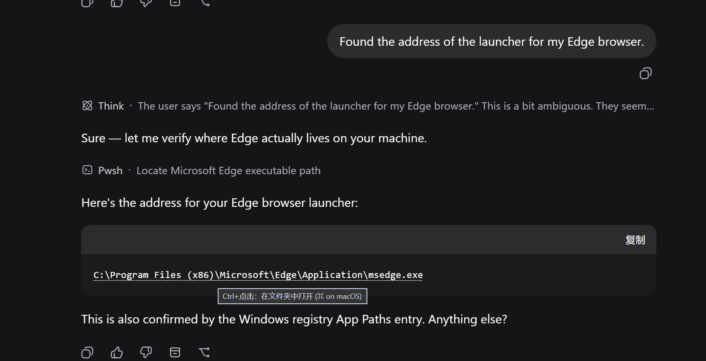
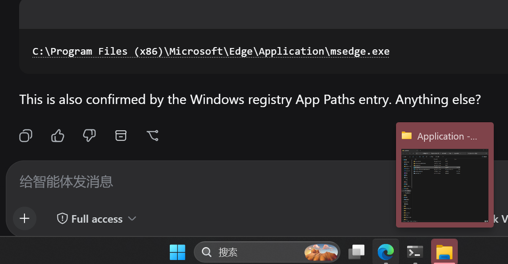

# dsh-pathlink

> [中文](README.zh.md) · [English](README.md)

**在 DeepSeek Harness 对话里，Ctrl+点击文件路径与链接。**

自动识别聊天消息（助手回复、用户气泡、代码块、工具卡片）中的文件路径和
URL，用淡淡的虚线下划线标记，**Ctrl+点击**（macOS 为 ⌘）即可打开：

- **路径 → 打开所在文件夹**——在系统文件管理器中打开该文件所在的文件夹并
  选中它（Windows `explorer /select`、macOS `open -R`、Linux 用 `xdg-open`
  打开父目录）；如果路径本身是目录，则直接打开目录。
- **链接 → 浏览器新标签页打开**——覆盖渲染器未自动转成链接的裸 URL
  （比如用户消息气泡里的）；markdown 链接本身已在新标签页打开。

普通点击不触发任何行为，不会干扰选中、复制等操作。路径不存在时会弹出
toast 提示原因，而不是静默失败。





> ① 悬停路径显示 Ctrl+点击提示，点击后在文件夹中定位该文件 ·
> ② 真实对话中被识别的路径（虚线下划线）。

## 安装

```sh
dsh plugin --profile web add dsh-pathlink
```

或从 GitHub 安装：

```sh
dsh plugin --profile web add github:penguin-oo/dsh-pathlink
```

安装后重启 Web 界面生效。仅支持 **web** 配置档（点击面是浏览器）。

## 使用

1. 等消息渲染完成后，被识别的路径/链接会带**虚线下划线**。
2. 按住 **Ctrl**（macOS 为 **⌘**）点击。
   - 路径 → 资源管理器/Finder 打开所在文件夹并选中该文件。
   - 链接 → 浏览器新标签页打开。
3. 相对路径先按该会话的工作目录解析，再按 Harness 进程目录解析；
   路径不存在时弹出 toast 提示。

## 配置

| 键 | 默认值 | 含义 |
| --- | --- | --- |
| `maxPathChars` | `1024` | 接受的路径文本最大字符数 |

## 实现原理

- **客户端**（`dsh.client`，platform `web`）：MutationObserver 驱动的扫描器
  监视已渲染的对话容器（`data-chat-flow` / `data-conversation-scroll`），
  在文本节点中识别路径与 URL，包成惰性行内 span，并用一个捕获阶段委托的
  click 监听统一处理。刻意不使用官方 `chatFileMentions` 缝，避免与内置
  deliverables 提供方冲突，同时保证所有表面（正文、行内代码、代码块、
  用户消息、工具卡片）行为一致。
- **宿主端**（`pathlink` Remote 服务）：只读的 `open` 方法——按所指向会话的
  工作目录解析相对路径、校验存在性、拉起平台文件管理器。无持久状态，不
  创建/恢复任何 Agent 或 Session。

## 开发

```sh
npm install
npm run build   # 打包 src/client → lib/client.js
npm run smoke   # Remote 标记 + Typert 清单校验
node scripts/e2e-synthetic.mjs   # 浏览器 E2E，目标 http://127.0.0.1:3738
```

`docs/demo.html` 由 `node scripts/build-demo.mjs` 构建（复用生产识别器），
截图用 `node scripts/e2e-screenshot.mjs` 生成。

## 限制

- 仅 Web 界面（点击面是浏览器）；宿主打开器覆盖 Windows / macOS / Linux。
- 路径识别基于启发式：中文目录名可正常保留；若路径末段是裸英文单词
  （无扩展名）且紧接英文正文，偶有过匹配——存在性校验会把这类误判挡在
  「路径不存在」toast 里，不会打开错误的东西。

## 许可证

MIT

## 致谢

为 DeepSeek Harness 插件生态而作——感谢 [LINUX DO](https://linux.do/)
社区的反馈与测试。
