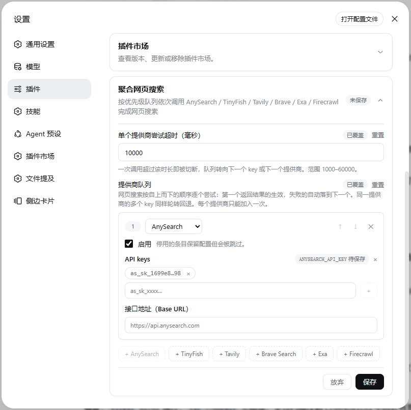

# dsh-web-search-aggregation

[English](./README.md) · [npm](https://www.npmjs.com/package/dsh-web-search-aggregation) · [GitHub](https://github.com/chendefine/dsh-web-search-aggregation)

[DeepSeek Harness](https://github.com/deepseek-ai/deepseek-harness)（DSH）双端插件：把内置 `web_search` 工具的搜索后端换成**一条按优先级排序的聚合队列（AnySearch / TinyFish / Tavily / Brave / Exa / Firecrawl / Jina / SerpApi / Serper）**——每个提供商可挂多个 API key 按轮转使用，任一次尝试失败自动落到下一个 key 或下一个提供商，第一个成功者生效。

    

## 特性

- **优先级队列，有序回退** —— 每次请求自上而下逐个尝试：第一个返回结果的生效，失败的条目自动落到下一个。顺序在设置卡片中实时编辑；每个提供商最多入队一次。
- **多 key 池 + 轮转** —— 每个提供商只读一个凭据（`ANYSEARCH_API_KEY` / `TINYFISH_API_KEY` / `TAVILY_API_KEY` / `BRAVE_SEARCH_API_KEY` / `EXA_API_KEY` / `FIRECRAWL_API_KEY` / `JINA_API_KEY` / `SERPAPI_API_KEY` / `SERPER_API_KEY`），其值为该提供商全部 key 用 `,` 拼接。同一条目内的 key 按轮转顺序尝试（每成功一次前进一格），在池内分摊负载与配额。
- **开箱即用** —— AnySearch 允许匿名访问，没配任何 key 时队列即可完成搜索。出厂默认只是启用全部九家——先后顺序完全由你在卡片里编排；需 key 的条目在凭据就位前只是跳过。
- **预算受控** —— 每次尝试有独立超时（默认 10s，范围 1–60s），一个挂死的上游吃不掉工具层预算；60s 内仍可容纳 5–6 轮完整回退。
- **失败可读** —— 全部失败时错误信息逐条列出每次尝试（`[2] tavily/TAVILY_API_KEY#1: 401 unauthorized; …`）。队列为空抛 `WEB_PROVIDER_UNAVAILABLE`；调用方取消立即抛 `WEB_ABORTED`。
- **密钥卫生** —— key 明文绝不进日志、绝不出现在失败记录里（只引用 `REF` / `REF#N` 标签）；设置卡片以打码 tag 展示，已存的值永不回显。
- **热配置** —— 「设置 → 插件 → 插件配置 → *Aggregated web search（聚合网页搜索）*」卡片随时编辑队列、key、端点与超时；提交后对下一次搜索即时生效，无需重启。

## 工作原理

| 半端 | 位置 | 职责 |
| --- | --- | --- |
| 宿主（服务端） | `src/` | 向 `ctx.web` 注册搜索 provider（id `aggregated`）；`cordis.patch.yml` 把 web seam 的 `searchProvider` 固定为本插件，并插入携带默认队列的插件行。 |
| 浏览器（客户端） | `src/client/` | 注册 *聚合网页搜索* 配置卡片，暂存队列草稿，经 settings + credentials 服务提交。 |

```
web_search (tool-web)
   └─ ctx.web.searchProvider = aggregated
        ├─ 队列（自上而下，首个成功者生效——顺序由用户编排）：
        │     anysearch · firecrawl · tavily · tinyfish · brave · exa · jina · serpapi · serper
        │       │   keys = 凭据值按 ',' 拆分          ← 每个提供商一个池
        │       │   无 key 的 AnySearch 条目允许匿名尝试
        │       └─ 每条目一个轮转游标（端点改动即重置）
        ├─ 每次尝试：adapter 请求，独立超时（默认 10s）
        └─ 全部失败 → WEB_PROVIDER_ERROR + 逐次尝试摘要
```

当前内置九个 adapter；接入下一个上游只需一个 adapter 模块加一行注册表。

| kind | 鉴权 | 默认端点 | 备注 |
| --- | --- | --- | --- |
| `anysearch` | Bearer（可选） | `https://api.anysearch.com/v1/search` | 允许匿名访问；`data.results[]` 信封 |
| `tavily` | Bearer | `https://api.tavily.com/search` | 发送 `max_results`；生成的答案附在 `content` |
| `tinyfish` | `X-API-Key` | `https://api.search.tinyfish.ai` | `GET ?query=…`；无条数参数，由 seam 的 `maxResults` 截断 |
| `brave` | `X-Subscription-Token` | `https://api.search.brave.com/res/v1/web/search` | `GET ?q=…&count=…`（count 夹在 1–20，关闭高亮装饰）；`page_age` → `publishedAt` |
| `exa` | Bearer | `https://api.exa.ai/search` | 发送 `numResults`（1–100）与 `contents.highlights`；第一条 highlight 作为摘要 |
| `firecrawl` | Bearer | `https://api.firecrawl.dev/v2/search` | 发送 `limit`（1–100）；不带 `scrapeOptions`——纯搜索结果，无逐页抓取费用 |
| `jina` | Bearer | `https://s.jina.ai` | `POST /` 携带 `{"q"}`；`X-Respond-With: no-content` 只取 SERP 条目（不逐页抓取）；`num`（1–20）仅在请求带条数时发送；`description` → 摘要、`publishedTime` → `publishedAt`；EU 镜像 `https://eu.s.jina.ai` |
| `serpapi` | `api_key` 查询参数 | `https://serpapi.com/search.json` | `GET ?engine=google&q=…&api_key=…`——key 只放 URL（该 API 拒绝放在 header/请求体）；`num`（1–100）仅在请求带条数时发送（官方注明带 `num` 的调用更易触发 CAPTCHA）；`snippet` → 摘要、`date` → `publishedAt`；顶层 `error` 响应（即便 HTTP 200）按失败处理，队列落到下一家 |
| `serper` | `X-API-KEY` 请求头 | `https://google.serper.dev/search` | `POST {"q": …}`，key 放 `X-API-KEY` 请求头；`num` 夹进官方 10–100 窗口、仅在请求带条数时发送（不足 10 向上取 10——seam 会按 `maxResults` 截断）；`link` → url、`snippet` → 摘要、`date`（Google 展示日期）→ `publishedAt`；非 2xx 的 `{"message": …}` 响应（如无 key 的 403）透出其消息 |

## 环境要求

- DSH web profile（`dsh web`），Node.js ≥ 22.19——与 DSH 自身要求一致（`^22.19.0 || >=24`）。从 GitHub 源码安装会在安装时执行 `prepare` 构建，版本要求相同。
- 至少一个上游可达：默认队列不配任何凭据即可用（AnySearch 匿名）；Tavily / TinyFish / Brave / Exa / Firecrawl / Jina / SerpApi / Serper 条目需配各自 API key 才会参与。

## 安装

从 npm registry 安装（预构建产物，无需构建授权）：

```sh
dsh plugin --profile web add dsh-web-search-aggregation
```

从 GitHub 仓库安装（源码型，pnpm 会在安装时跑 `prepare` 构建；若 pnpm 拦截构建脚本，请在 `profiles/web/pnpm-workspace.yaml` 中放行该包）：

```sh
dsh plugin --profile web add github:chendefine/dsh-web-search-aggregation
```

或通过 DSH 插件市场（设置 → DSH插件市场）一键安装——本仓库带 `dsh-plugin` topic，会被自动收录。

bundle 插件加入 profile 层栈后需**重启 `dsh web`** 生效；卸载用 `dsh plugin --profile web remove dsh-web-search-aggregation` 后重启。

## 配置项

设置卡片（设置 → 插件 → 插件配置 → *聚合网页搜索*）实时编辑 `web-search-aggregation` 设置段：



| 字段 | 默认 | 说明 |
| --- | --- | --- |
| `providers` | 九条启用条目——每种一家 | 优先级队列。每个条目：提供商（每种最多一次）、启用开关（停用条目保留配置但被跳过）、可选的端点 base URL（覆盖默认）。出厂顺序不代表任何含义，可随意编排。 |
| `attemptTimeoutMs` | `10000` | 单次尝试超时（毫秒，1000–60000）。超时即切断，队列转向下一个 key 或下一个条目。 |

API key 在每个条目上以**打码 tag** 管理：一次输入一个（`+` 或回车加入），tag 顺序即保存与运行时读取的顺序。已存的 key 不回显，保存将整体替换该池；关闭全部 tag 再保存即清空凭据。每个提供商的 key 存于唯一固定凭据：

| 凭据 | 提供商 | 是否必需 | 值格式 |
| --- | --- | --- | --- |
| `ANYSEARCH_API_KEY` | AnySearch | 否——匿名可用 | 单个 key 裸存，多个用 `,` 拼接 |
| `TAVILY_API_KEY` | Tavily | 是（条目可用前提） | 同上 |
| `TINYFISH_API_KEY` | TinyFish | 是（条目可用前提） | 同上 |
| `BRAVE_SEARCH_API_KEY` | Brave Search | 是（条目可用前提） | 同上 |
| `EXA_API_KEY` | Exa | 是（条目可用前提） | 同上 |
| `FIRECRAWL_API_KEY` | Firecrawl | 是（条目可用前提） | 同上 |
| `JINA_API_KEY` | Jina Search | 是——搜索 API 拒绝匿名调用 | 同上 |
| `SERPAPI_API_KEY` | SerpApi | 是——该 API 拒绝无 key 调用 | 同上（key 为 64 位十六进制，无前缀） |
| `SERPER_API_KEY` | Serper | 是——该 API 拒绝无 key 调用（403） | 同上（key 无前缀） |

### 与其他 provider 插件组合

bundle patch 会**整体替换** web seam 行的 config，因此最后应用的层决定最终的 `searchProvider` / `fetchProvider` 组合。本插件的 patch 只声明 `searchProvider: aggregated`——只认领搜索选择权，别的不碰。两个推论：

- 先装 `dsh-web-fetch-playwright` 再装本插件（或不装前者）时无需任何调整：未配置的 `fetchProvider` 会自动选中唯一注册的 fetch provider。
- 若另一插件的层在本插件**之后**应用并重置了 `searchProvider`，请在 profile 自己的 `profiles/web/cordis.patch.yml` 中固定组合选择——用户层压过所有 bundle 层：

  ```yaml
  - id: web
    config:
      searchProvider: aggregated
      fetchProvider: playwright
  ```

## 开发

```sh
pnpm install
pnpm typecheck   # tsc --noEmit
pnpm test        # vitest run（103 个单元测试，不联网）
pnpm build       # tsc 声明 + tsdown（宿主 ESM + 客户端 module-registration bundle）
```

仓库结构：

```
src/
├── index.ts               # 宿主入口：注册 provider 与设置段
├── config.ts              # schemastery schema、默认值、队列归一化
├── provider.ts            # AggregatedSearchProvider：队列遍历、轮转、超时
├── keys.ts                # ',' 拼接 key 池词汇（解析/格式化/打码）
├── types.ts               # 队列条目、配置、单次尝试失败记录
├── adapters/              # AnySearch / Tavily / TinyFish / Brave / Exa / Firecrawl / Jina / SerpApi / Serper adapter + 共享 HTTP
└── client/                # 浏览器半端：设置卡片、表单模型、多语言
tests/                     # config、keys/adapters、provider、client-controller
```

开发与发布流程见 [CONTRIBUTING.md](./CONTRIBUTING.md)，安全模型与漏洞报告见 [SECURITY.md](./SECURITY.md)。

## 安全边界

搜索词与 API key 只发往每个队列条目配置的端点（默认九家提供商的官方 API）。key 存于 DSH credentials 域——不落 settings 文件、不进日志、不回显客户端。失败记录与日志只引用打码标签（如 `TAVILY_API_KEY#2`），不含明文。除请求它的会话外，不保留任何结果数据。

## 许可证

[MIT](./LICENSE) © 2026 chendefine
